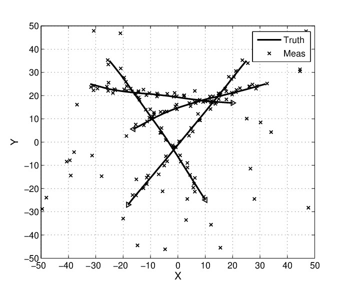

+++
author = "frdnd"
title = "Vortragsankündigung"
date = "2020-01-30"
categories = ["Log"]
hide_readingtime = true
+++

Viele von uns hätten so viel interessante Sachen zu erzählen, aber es braucht oft viel Überwindung einen Vortrag zu halten. Umso schöner ist es, dass wir in den nächsten Wochen gleich zwei Vorträge haben.

Karotte/Lotta spricht am 06.02.2020 ab 20:00h über **Vorwärts-Rückwärtsglättung von Objekttrajektorien unter Nutzung von Random-Finite-Sets.** Zu Random-Finite-Sets findet man bei Wikipedia keinen Eintrag, deshalb hier ein [Abstract ](https://ora.ox.ac.uk/objects/uuid:09211ed9-7cc1-4401-9ae9-a1ebc2a1f782):

*Multitarget tracking is the process of jointly determining the number of targets present and their states from noisy sets of measurements. The difficulty of the multitarget tracking problem is that the number of targets present can change as targets appear and disappear while the sets of measurements may contain false alarms and measurements of true targets may be missed. The theory of random finite sets was proposed as a systematic, Bayesian approach to solving the multitarget tracking problem. The conceptual solution is given by Bayes filtering for the probability distribution of the set of target states, conditioned on the sets of measurements received, known as the multitarget Bayes filter.*

Diese Methode kann man im Kontext von Audio, RF, Antennen-Arrays oder aber auch bei autonomen Fahrzeugen im Rahmen der Umfeldmodells verwenden.

Petersilie/Jan stellt am 20.02.2020 ab 20:00h [Confluence](https://en.wikipedia.org/wiki/Confluence_(software)), eine Collaboration Software von Atlassian, vor. 

Freifunk Ulm nutzt Confluence statt eines Wikis (ob Confluence vielleicht ein Wiki ist, fragt ihr am besten Jan), die Nutzung ist kostenfrei für gemeinnützige Organisationen. 

